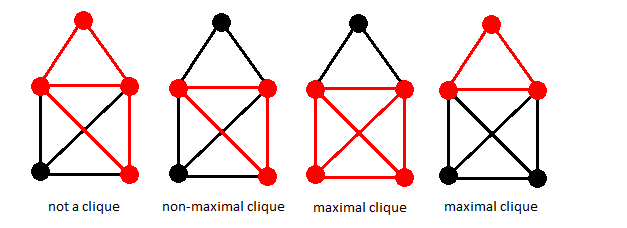
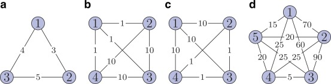

# GFS
Unsupervised graph feature selection/ranking through Max weighted clique

*This repo contains different projects oriented to develop and test quantum
algorithms in various fields and scenarios. The key idea behind this work, is
to integrate these algorithms with the final aim of publicizing 
papers, by focusing on their feasibility and applicability to concrete problems which will merge,
for example AI developing models, feature selection, Healthcare applications, Physics
simulations and so on...*

### Unsupervised Graph Feature Selection algorithm based on the Weighted Maximal Clique Problem

The clique problem is the computational problem of finding cliques (subsets of vertices,
all adjacent to each other, also called complete **sub-graphs**) in a graph.
It has several different formulations depending on which cliques,
and what information about the cliques, should be found.
Common formulations of the clique problem include finding a **maximum clique**
(a clique with the largest possible number of vertices),
finding a maximum weight clique in a weighted graph, listing all maximal cliques (cliques that cannot be enlarged),
and solving the decision problem of testing whether a graph contains a clique larger
than a given size.
The Maximum Weighted Clique Problem (MWCP) can be seen as the generalization
of Boolean quadratic programming and maximal clique problems with a cardinality
constraint. So it is a NP-hard problem. In the work of Hunting et al. [@hunting2001lagrangian] several applications are given, for example to facility location and dispersion problem. This problem
also arises as a subproblem in a column generation approach to graph partionning [Nam2011onglobally].

The WMCP formulation is as follows:

Let $K_n = (V, E)$ be the complete undirected graph with
$V = {1, 2,..., n}$. To every node $i \in V$ a weight $d_i$
is assigned and weights $c_{ij}$ are associated to the edges in $E$. The WMCP is to find, among all complete subgraphs with at most $b$
nodes (for some integer $b \in {1, 2, . . . , n}$),
a subgraph (clique) for which the sum of the weights of
all the nodes and edges in the subgraph is maximum [Nam2011onglobally].
Mathematically speaking, a natural non-linear formulation can be to find

max $\sum_{i=1}^{n} d_i x_i + \sum_{i=1}^{n-1}\sum_{j=i+1}^{n} c_{ij}x_i x_j$

subject to the constraint

$\sum_{i=1}^{n} x_i \leq b$, where $x_i \in \{0, 1\} \ \ \ \forall i = 1, 2, ..., n$.

The idea behind this algorithm is that it can be used as a prototype
of an *unsupervised* method to do feature selection on a given dataset
of a selected problem. Moreover, since there is a straightforward application
on the domain of graphs, it could be interesting to see whether 
it can be applied to the domain of graph neural networks (GNNs) or
either imaging. *The idea of merging WMCP to feature selection* arises
directly from this paper [zhang2011graph] where it is explicitly
mentioned the link between WMCP and Dominant Set Problem (DSP). In particular,
in the paper it is said that the DSP which links to WMCP serves 
as a proxy to find the best cluster or set of aggregated features. The
actual feature selection (FS) is performed later. Here, we can 
have a look at the feasibility of this algorithm with simulated 
and quantum annealer. An idea which can simply illustrate what
we want to achieve is depicted below.

As we can see, in the **d)** diagram, the WMCP aims to select the
connected subgraphs whose sum of node and edge weights is maximal.
Even though each node has a simple value that makes the sum
of nodes very trivial to calculate, the sum of all the weights of the 
connected subgraphs is not. But since this example is done
only to illustrate the problem, we can conclude that the maximal-weighted clique we expect is formed by node $n = {1, 2, 3}$.
